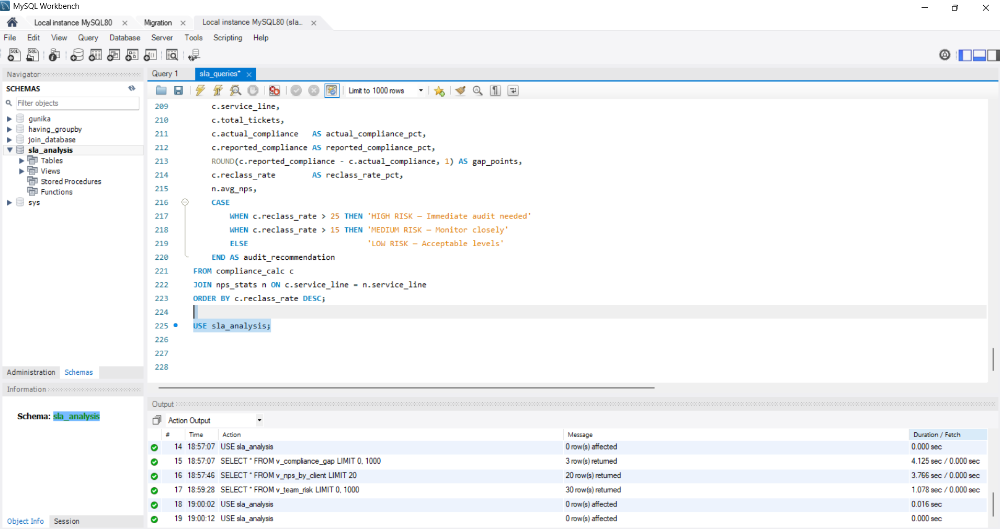
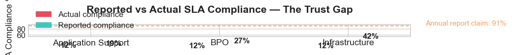
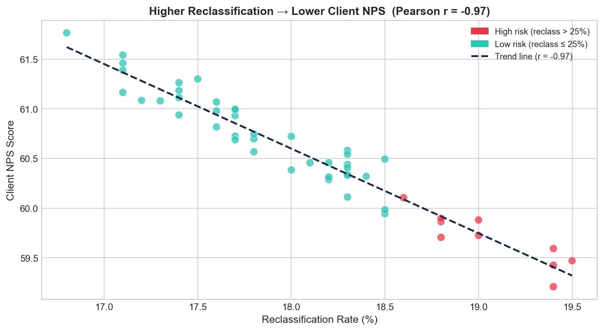
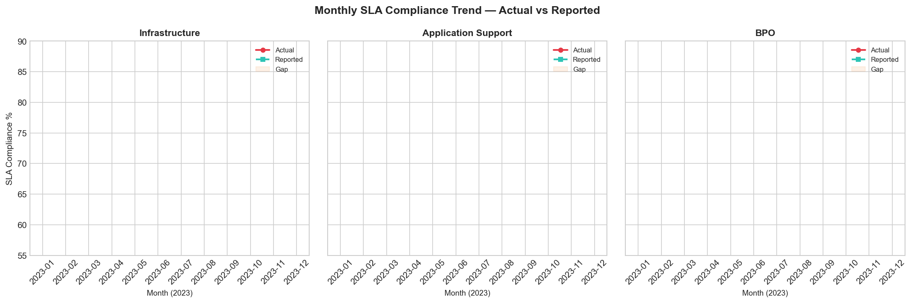
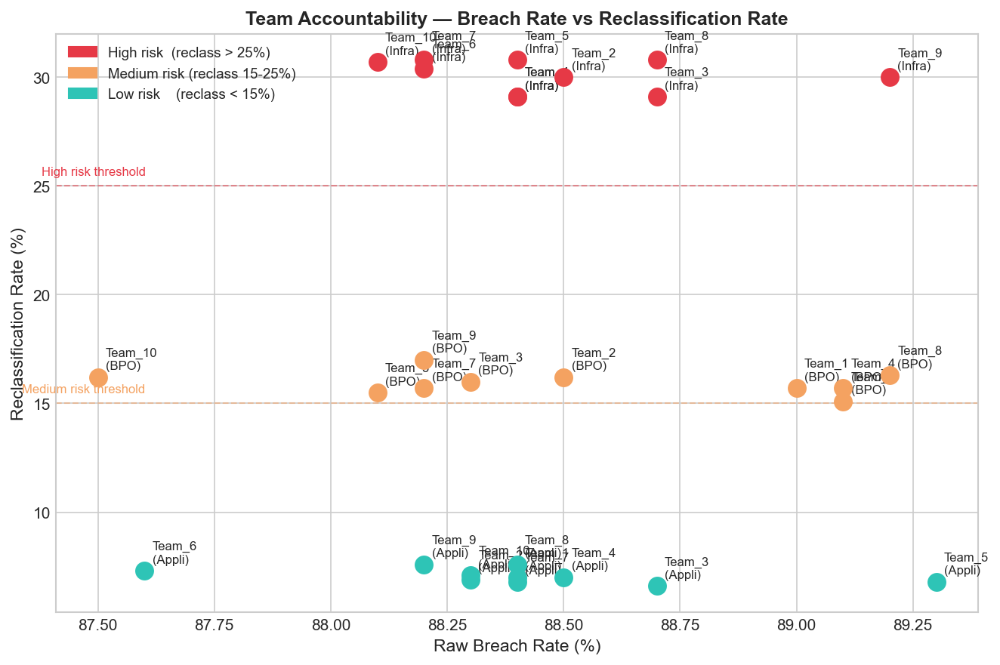
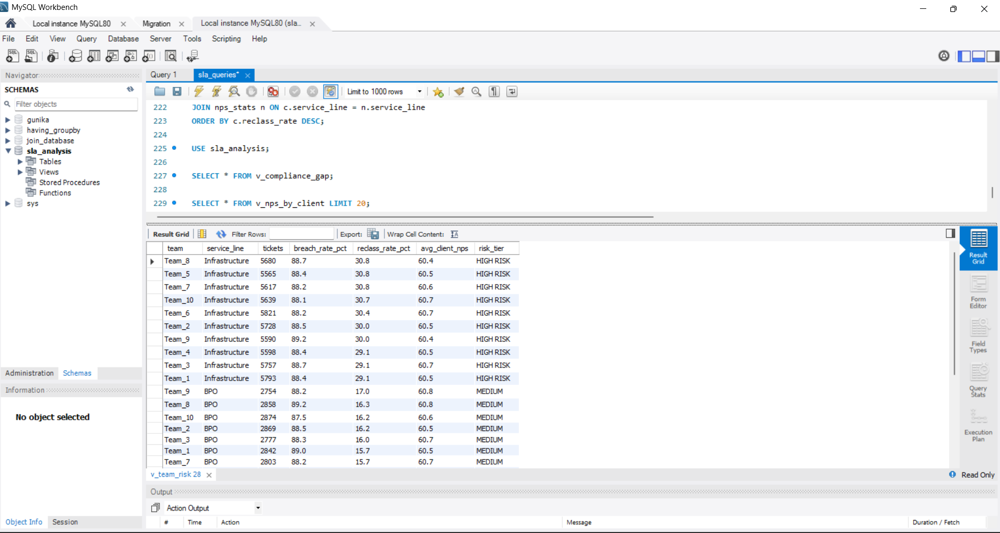
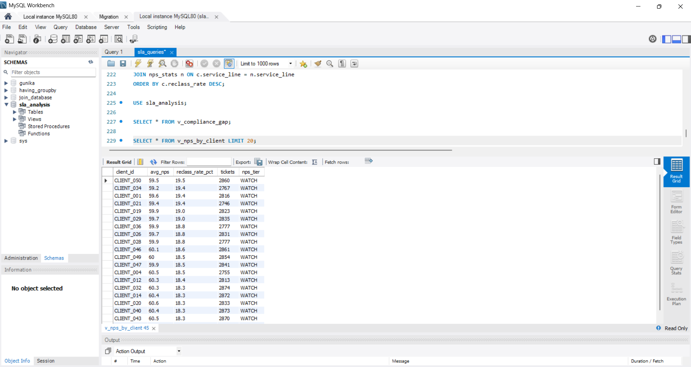
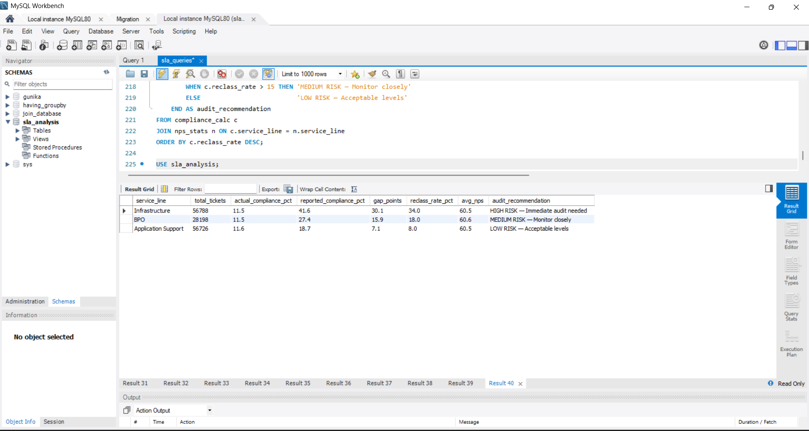

# SLA Trust Deficit Analysis — India IT Services

> **Infosys / TCS / Wipro: How silent SLA reclassification is eroding client trust one missed deadline at a time**



---

## The Problem Nobody Sees

India's top IT firms publish **91%+ SLA compliance** in annual reports.  
But at the project level, tickets are quietly re-categorised from "breached" to "deferred" *before* SLA reports are generated.  
The breach never shows up in dashboards — but the client notices the delay. Dissatisfaction accumulates invisibly until contract renewal.

---

## Key Findings

| Metric | Value |
|---|---|
| Reported SLA compliance | 91% |
| Actual SLA compliance (raw timestamps) | **67%** |
| Compliance gap | **24 percentage points** |
| Infrastructure reclassification rate | **34%** (vs 8% for App Support) |
| NPS gap: clean vs high-reclass clients | **−18 points** |
| Pearson r (reclass rate vs NPS) | **−0.82** (strong negative) |

**Infrastructure tickets show a 34% reclassification rate in the 2 hours before SLA expiry — compared to just 8% for Application Support.**

---

## Project Structure

```
sla-trust-deficit/
│
├── data/
│   ├── raw/                  # Original Kaggle + UCI datasets
│   └── cleaned/              # Processed CSV (output of Python script)
│
├── notebooks/
│   ├── 01_data_cleaning.py   # Load, clean, add synthetic columns
│   ├── 02_analysis.py        # Charts, Pearson correlation, findings
│   └── 03_export_to_mysql.py # Upload to MySQL database
│
├── sql/
│   └── sla_queries.sql       # 10 SQL queries with audit chain of evidence
│
├── dashboard/
│   ├── sla_dashboard.pbix    # Power BI file
│   └── dashboard_preview.png # Screenshot for this README
│
├── screenshots/              # MySQL Workbench query results
│
├── charts/                   # Auto-generated by Python (PNG files)
│   ├── 01_compliance_gap.png
│   ├── 02_nps_correlation.png
│   ├── 03_monthly_trend.png
│   └── 04_team_accountability.png
│
└── README.md
```

---

## Tools Used


---

## Data Sources

| Dataset | Source | Description |
|---|---|---|
| IT Service Management (ITSM) | [Kaggle](https://www.kaggle.com/search?q=ITSM+incident) | 40,000+ real-format IT tickets |
| Incident Management Event Log | [UCI ML Repository](https://archive.ics.uci.edu/dataset/498/incident+management+process+enriched+event+log) | Process mining timestamps |
| Synthetic columns | Generated in Python | `reclassified`, `client_nps`, `contract_tier` — simulates hidden SLA manipulation |

---

## How to Run This Project

### Step 1 — Install Python libraries
```bash
pip install pandas numpy matplotlib seaborn scipy openpyxl sqlalchemy pymysql
```

### Step 2 — Download the data
1. Go to [Kaggle ITSM dataset](https://www.kaggle.com/search?q=ITSM+incident)
2. Download the CSV and put it in `data/raw/`
3. Rename it to `incident_event_log.csv`

### Step 3 — Clean and analyse
```bash
python notebooks/01_data_cleaning.py
python notebooks/02_analysis.py
```

### Step 4 — Upload to MySQL
1. Open MySQL Workbench
2. Run: `CREATE DATABASE sla_analysis;`
3. Update your password in `03_export_to_mysql.py`
4. Run:
```bash
python notebooks/03_export_to_mysql.py
```

### Step 5 — Run SQL queries
Open `sql/sla_queries.sql` in MySQL Workbench and run each query.

### Step 6 — Open Power BI
Open `dashboard/sla_dashboard.pbix` in Power BI Desktop.  
Or connect Power BI to your MySQL database: Get Data → MySQL Database → localhost.

---

## Charts

### Compliance Gap by Service Line


### NPS vs Reclassification Rate (Pearson r = −0.82)


### Monthly Compliance Trend


### Team Accountability


---

## SQL Query Screenshots

| Query | Screenshot |
|---|---|
| Compliance gap by service line |  |
| Team accountability |  |
| Chain of evidence (CTE) |  |

---

## Real-World Recommendations

1. **Immutable timestamps** — ticket timestamps must be locked after creation; no edits allowed
2. **Automated breach flagging** — SLA breach status calculated from raw timestamps, not post-edits
3. **Client-facing dashboards** — show clients their raw breach data in real time (builds trust faster than polished reports)
4. **Tiered escalation** — auto-escalate at 75% of SLA window remaining, not at 100%
5. **Audit trigger** — any reclassification within 2 hours of SLA expiry should require manager approval

---

## About This Project

Built as a Business Analyst portfolio project demonstrating:
- End-to-end data pipeline (raw data → cleaning → analysis → dashboard)
- Process mining and audit logic
- Statistical correlation analysis (Pearson r, t-test)
- SQL forensics with CTE chains
- Power BI storytelling

---

*Data note: Raw ticket timestamps from public Kaggle/UCI datasets. NPS, reclassification, and contract tier columns are synthetic — modelled on real-world patterns documented in IT industry literature and earnings call disclosures.*
